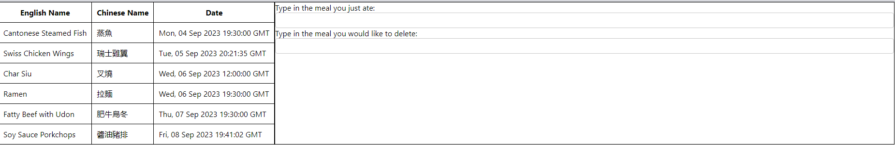

## Preview:




<br/>

## Setup Guide:

<br/>

### Server:
* Create a virtual environment (optional), and install the packages in requirements.txt.
* Create a text file in the format of (filling the relevant variables with your own.):
```python
class Config:
    MYSQL_HOST = 'hostname'
    MYSQL_USER = 'username'
    MYSQL_PASSWORD = 'password'
    MYSQL_DB = 'db_name'
```
* Then, having installed the packages, run the following in command prompt:
```
flask --app server run
```

<br/>

### Client:
* Install the packages in package.json, then run npm start in the client folder.

<br/><br/>

## Things I'm working on:
* Better UI/UX.
* Handling for Chinese and English input at the same time.
* More features, including the ingredients of each dish, then depending on the season it currently is, the app will display a different dish.
* Clickable table on the left to do inputs.
* Set up a server with my own PC such that others in the same household can also use the system.